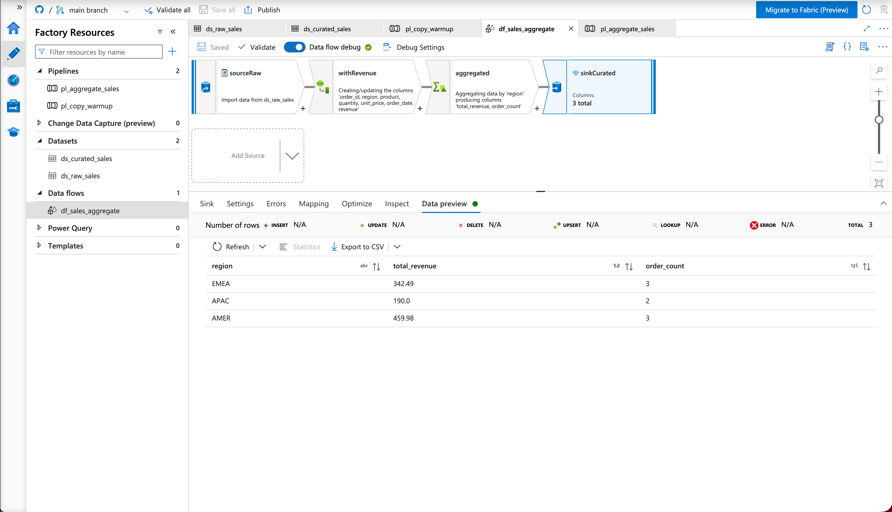
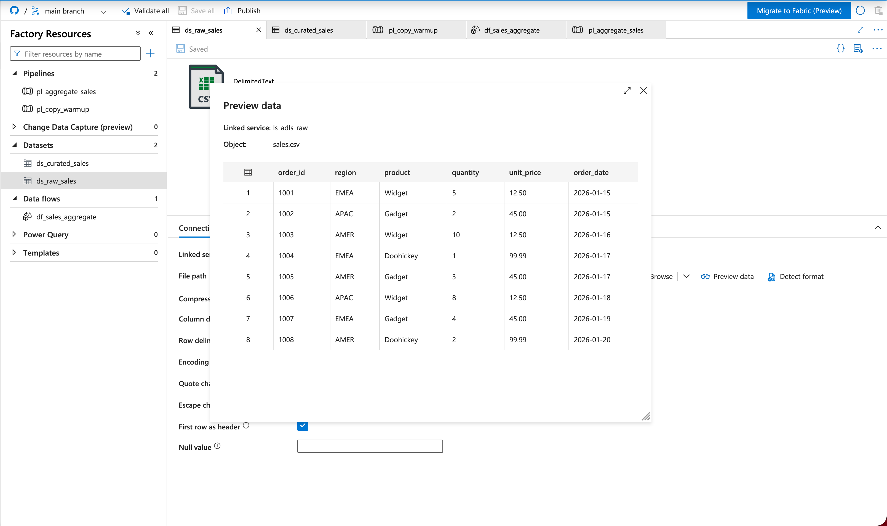
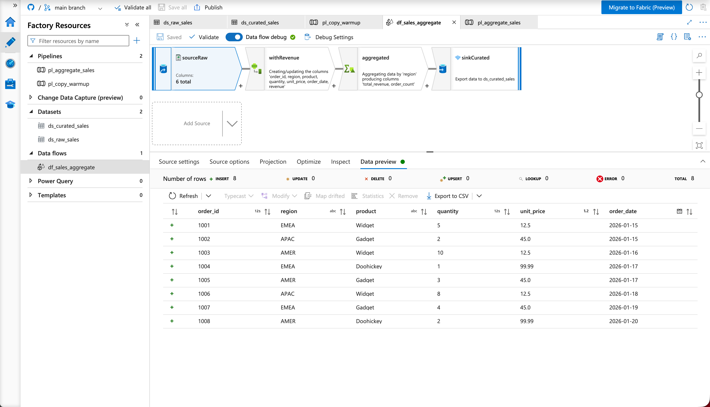
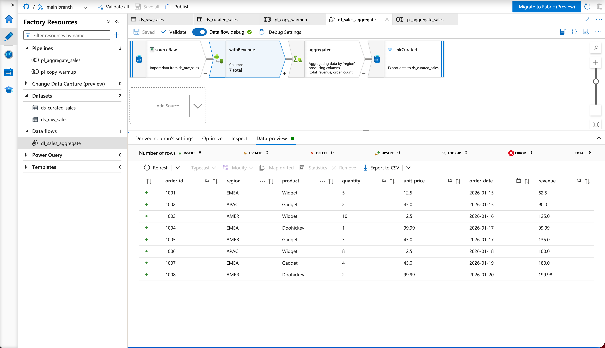
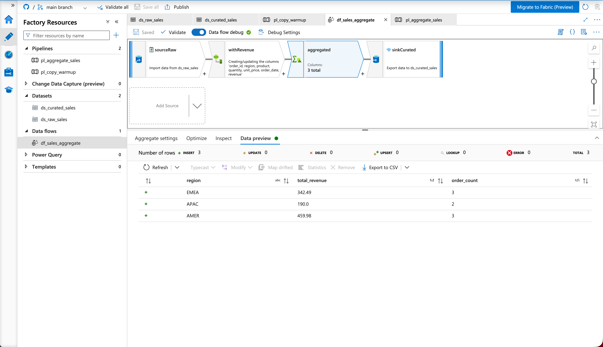
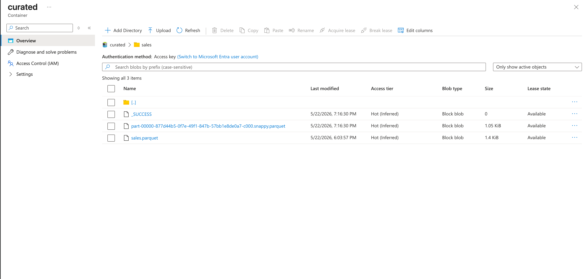
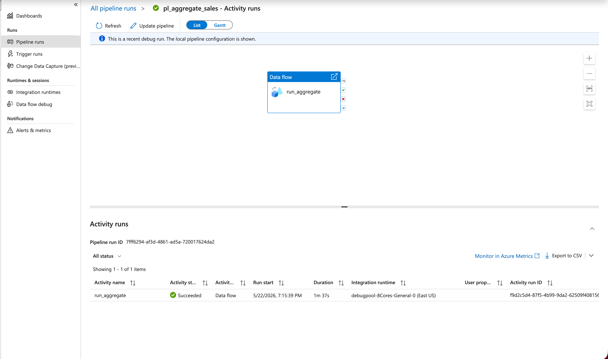
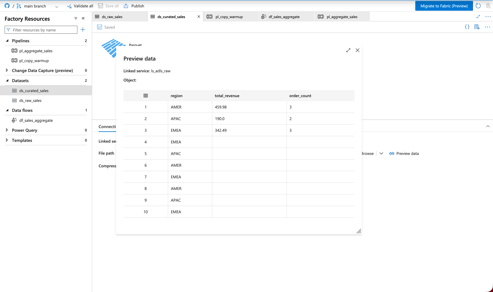

# Session 1 — Azure Data Factory: Full Notes

> **Interview revision file.** Read top-to-bottom the night before. Use the cheat sheet section the morning of.

## TL;DR — what to say in 30 seconds

> "I built an end-to-end Azure Data Factory pipeline that ingests sales data from CSV in ADLS Gen2, transforms it via a Mapping Data Flow with a derived column for revenue calculation and an aggregate to summarize by region, and writes the result back as partitioned Parquet. The whole factory is version-controlled via Git integration to GitHub, so the linked services, datasets, data flow, and pipelines are all committed as JSON I can review and deploy via CI/CD."

That's your headline answer. Everything below is the depth behind it.

---

## What I built — visual overview

The complete data flow with Git integration showing in the top bar:



Four stages, left to right:
1. **sourceRaw** — reads `sales.csv` from `raw/` container
2. **withRevenue** — adds computed `revenue = quantity * unit_price`
3. **aggregated** — groups by region, sums revenue, counts orders
4. **sinkCurated** — writes Parquet to `curated/sales/`

---

## Architecture

```
ADLS Gen2 Storage Account (kklab29057)
├── raw/                          ← Source container
│   └── sales.csv                 (8 rows of order data)
└── curated/                      ← Destination container
    └── sales/
        ├── _SUCCESS              (Spark success marker)
        └── part-00000-...snappy.parquet  (3 rows of regional summaries)

Azure Data Factory (adf-kklab-3398)
├── Linked service: ls_adls_raw   → connects to ADLS Gen2
├── Datasets:
│   ├── ds_raw_sales              → points at raw/sales.csv (DelimitedText)
│   └── ds_curated_sales          → points at curated/sales/ (Parquet)
├── Data flow: df_sales_aggregate (the 4-stage flow above)
└── Pipelines:
    ├── pl_copy_warmup            (Copy activity — simple A→B)
    └── pl_aggregate_sales        (wraps the Data Flow for execution)

GitHub (azure-data-prep)
└── session-1-adf/
    ├── linkedService/  ds_curated_sales.json, etc.
    ├── dataset/
    ├── dataflow/
    ├── pipeline/
    └── factory/
```

---

## Step-by-step: how the flow processes data

### Stage 1 — Source ingestion

The CSV starts as 8 rows of order data:



In the data flow, this becomes the `sourceRaw` stage with 6 columns:



**Key concept — Projection:** when ADF imports the source schema, it sniffs the CSV and infers types. In my case it correctly identified `order_id` and `quantity` as integers, `unit_price` as decimal, `order_date` as date. If types had come in as all strings, downstream math would have failed silently or thrown errors.

**Reference file:** [`dataset/ds_raw_sales.json`](dataset/ds_raw_sales.json) — the dataset definition

### Stage 2 — Derived column

Added a computed `revenue` column using the expression `quantity * unit_price`:



Output now has 7 columns. Each row: revenue = quantity × unit_price (e.g., 5 × 12.5 = 62.5).

**Key concept — Expression language:** Data Flow exposes ~hundreds of functions because it runs on Spark. Functions like `toInteger()`, `coalesce()`, `iif()`, `regex_replace()`, date arithmetic, type casting — all available because Spark SQL is doing the work under the hood. Copy Activity doesn't have this because it doesn't run on Spark.

### Stage 3 — Aggregate (group by)

Group by `region`, compute `sum(revenue)` as `total_revenue` and `count(order_id)` as `order_count`:



8 rows → 3 rows (EMEA / APAC / AMER).

**Key concept — Spark shuffle:** group-by is the most expensive operation in distributed processing. Every row with the same group key must physically move to the same worker. That cross-network movement is a *shuffle* — typically 10-100x more expensive than non-shuffle operations. Half of data engineering performance work is minimizing shuffles.

### Stage 4 — Sink (Parquet output)

Wrote the 3 aggregated rows to `curated/sales/` as Parquet:



Three files appeared:
- `_SUCCESS` (0 bytes) — Spark's "I finished writing atomically" marker
- `part-00000-877d44b5-...-c000.snappy.parquet` (1.05 KiB) — Data Flow output
- `sales.parquet` (1.4 KiB) — leftover from the earlier Copy activity warm-up

**Reference file:** [`dataflow/df_sales_aggregate.json`](dataflow/df_sales_aggregate.json) — full data flow definition

### Pipeline execution

The data flow wrapped in a pipeline and executed successfully:



Duration: **1m 37s** — most of that was Spark execution. The cluster was warm (2s startup time) because Data Flow Debug had been running.

**Reference file:** [`pipeline/pl_aggregate_sales.json`](pipeline/pl_aggregate_sales.json)

---

## The bug I hit (and what I learned)

When I previewed the `ds_curated_sales` dataset, I got 10 rows instead of 3:



**What happened:** Both my Copy activity and my Data Flow wrote to the same `curated/sales/` directory, but with completely different schemas:
- Copy wrote `sales.parquet` with `order_id, region, product, quantity, unit_price, order_date`
- Data Flow wrote `part-00000-...snappy.parquet` with `region, total_revenue, order_count`

When ADF previews the dataset, it does a schema-merge UNION across all Parquet files in the directory. Rows from the Copy output show up with NULLs in the columns that only exist in the Data Flow output → Frankenstein result.

**Two production lessons:**
1. **Pick separate directories per output.** Don't share folders across pipelines with different schemas.
2. **For overwrite workflows, check "Clear the folder"** in sink settings. For append workflows, partition by date so files don't collide schema-wise.

This is a real bug I hit — interviewers love hearing about real bugs over textbook knowledge.

---

## Core concepts mastered

### 1. ADLS Gen2 = Blob Storage + Hierarchical Namespace

- **Blob Storage** = flat object store. Paths like `folder/file.txt` are just object names with slashes — no real folders. Renaming a "folder" means individually renaming every blob.
- **ADLS Gen2** = blob storage account with `--hns true` (Hierarchical Namespace). Adds real directory objects you can rename atomically, set POSIX ACLs on, list efficiently.
- **The `abfss://` protocol** requires HNS. Without HNS, you'd use `wasbs://` (the legacy blob driver) which is much slower for analytics — no efficient partition pruning, no POSIX ACLs.

**Interview answer to "what's the difference between Blob Storage and ADLS Gen2?":**
> "ADLS Gen2 *is* a blob storage account with Hierarchical Namespace enabled. Same underlying resource type, same SLAs, same redundancy options. HNS just adds a real directory layer with POSIX-style ACLs on top, which is what makes it suitable for analytics workloads. Tools like Spark, Synapse, Databricks all use the `abfss://` driver which only works against HNS-enabled accounts."

**Trap to avoid:** in the ADF UI, the ADLS Gen2 container is called "File system." In the Blob API it's called "container." In the ADLS Gen2 API it's called "filesystem." Same object, three names. Don't get tripped up.

### 2. ADF concept hierarchy

| Concept | What it is | Analogy |
|---|---|---|
| **Linked Service** | The connection definition (how to reach a storage account / DB) | Connection string |
| **Dataset** | A specific file/table inside a linked service | Table/file reference |
| **Activity** | A unit of work (copy, transform, run notebook, etc.) | A function call |
| **Pipeline** | A graph of activities with triggers | A workflow |
| **Integration Runtime** | The compute that runs the activity | Worker / runner |

One linked service can back many datasets. One pipeline can chain many activities. The separation is what makes it composable.

**Reference files:**
- [`linkedService/ls_adls_raw.json`](linkedService/ls_adls_raw.json)
- [`dataset/ds_raw_sales.json`](dataset/ds_raw_sales.json)
- [`pipeline/pl_aggregate_sales.json`](pipeline/pl_aggregate_sales.json)

### 3. Copy Activity vs Data Flow — the most important comparison

| | Copy Activity | Data Flow |
|---|---|---|
| **What it does** | Movement + minimal mapping | Visual transformations at scale |
| **Compute** | Lightweight serverless workers | Spark cluster |
| **Capabilities** | Source-to-sink movement, column mapping, type conversion | Joins, aggregates, pivots, lookups, derived columns, window functions, conditional splits |
| **Startup time** | 10-30 seconds (queue + warm up) | 3-5 minutes cold start; ~2 sec on warm cluster |
| **Cost** | Cheap (DIU-hours) | Expensive (vCore-hours on Spark) |
| **Expression language** | Limited | Rich (hundreds of functions) |
| **When to use** | Raw data movement; format conversion; A→B with no/minimal transform | Real transformations, joins, group-bys |

**Rule of thumb to memorize:** "If I could express the work as `INSERT INTO target SELECT * FROM source` with optional column rename, Copy is fine. Anything more — Data Flow."

**Common production pattern:** Use Copy to land raw data fast (cheap, simple). Use Data Flow to transform raw → curated (expensive but powerful). Many pipelines have both.

### 4. Spark shuffles — the dominant cost in distributed compute

When you do a group-by or join, every row with the same key must end up on the same worker. Spark achieves this by:
1. Computing a hash of the group key on each row
2. **Physically moving rows across the network** so all rows for the same key land on one worker
3. *Then* doing the aggregate/join

That network movement is called a **shuffle**. It's:
- The single most expensive operation in distributed processing
- Often 10-100x slower than non-shuffle operations
- Involves network I/O + disk spill when data doesn't fit in memory

**Strategies to minimize shuffles** (interview gold):
- **Pre-partition** data by the key you query most often (no shuffle needed)
- **Broadcast joins** for small lookup tables (avoids shuffling the big table)
- **Aggregate early** in the pipeline (smaller data → smaller shuffle)
- **Filter early** (less data to shuffle at all)

### 5. Parquet vs CSV — five reasons (memorize all)

1. **Columnar storage = massive analytics speedup.** Querying `SUM(revenue)` reads only the `revenue` column, not the whole file. If you have 50 columns and query 1, you do ~50x less I/O than CSV.

2. **Compression — typically 5-10x smaller than CSV.** Columnar layout puts similar values together, which compresses far better than interleaved row data.

3. **Schema is embedded in the file.** Parquet stores types as metadata. CSV has no types — everything is string until something parses it. With Parquet, no "is this column INT or DECIMAL?" debate.

4. **Predicate pushdown + partition pruning.** Parquet stores min/max statistics per row group. When you query `WHERE date > '2026-03-01'`, the engine skips entire row groups without reading them.

5. **Industry standard.** Spark, Synapse, Snowflake, BigQuery, Athena, Databricks, Trino — all first-class Parquet support. Modern lake formats (Delta, Iceberg, Hudi) are built *on top of* Parquet.

**Memorable framing:** *"CSV is for exchange. Parquet is for analytics."* Different jobs.

**Gotcha I hit:** For tiny files (my 8-row dataset), Parquet was actually *bigger* than CSV (1.4 KB vs 350 bytes). Why? Parquet metadata overhead dominates at small scale. Parquet starts winning around thousands of rows.

### 6. Authentication methods — ranked

**Managed Identity > Service Principal > SAS > Account Key**

| Method | Use case | Why |
|---|---|---|
| **Managed Identity** | Best for prod when both sides are Azure | No credentials to store/rotate; identity tied to resource; full audit trail |
| **Service Principal** | Cross-tenant or external (non-Azure) consumers | Still works without managed identity, but you manage a secret/cert |
| **SAS (Shared Access Signature)** | Time-limited, scoped external access ("partner needs read access for 7 days") | Better than account key but still a string to manage |
| **Account Key** | Dev/test only — NEVER prod | Master credential, full account access, painful rotation, no per-action audit |

**Why Account Key is bad for prod (4 specific reasons):**
1. It's a master credential — anyone with it has full control over the entire storage account
2. Painful rotation — must update every system using it simultaneously
3. No audit trail of *who* used it — logs show "the key was used", not which person/service
4. It's a secret you have to store somewhere — every place is another leak point

**Why Managed Identity wins for prod:**
1. No credentials to store or rotate
2. Lifecycle bound to the resource
3. RBAC granularity (e.g., grant `Storage Blob Data Reader` on just one container)
4. Full audit trail with identity names
5. Nothing to phish or leak

### 7. ADF Git integration — the two-branch model

- **Collaboration branch** (e.g., `main`): contains the JSON source code of your factory (linked services, datasets, pipelines, data flows). This is what developers edit via the ADF UI.
- **Publish branch** (e.g., `adf_publish`): contains ARM templates generated when you click "Publish" in the UI. This is what CI/CD pipelines deploy from.

The flow:
```
Developer edits in ADF Studio (collaboration branch)
    ↓
Reviews + PRs to main
    ↓
Clicks "Publish" in ADF UI
    ↓
ADF generates ARM templates → adf_publish branch
    ↓
Azure DevOps Pipeline deploys ARM templates to TEST/PROD factories
```

**Reference file:** [`publish_config.json`](publish_config.json) — defines which branch is publish

**Interview question this answers:** "How do you do CI/CD for ADF?" → Walk through the two-branch model + Azure DevOps Pipelines picking up `adf_publish`.

### 8. Integration Runtime + TTL — the cost vs latency dial

**Problem:** Each Data Flow activity normally cold-starts a Spark cluster (3-5 min). With 20 activities, that's 60-100 minutes of pure startup overhead.

**Solution:** Configure an **Azure Integration Runtime with TTL** (Time To Live).

- First activity cold-starts the cluster (3-5 min)
- Subsequent activities within the TTL window (e.g., 30 min) reuse the warm cluster (~2 sec each)
- After idle TTL period, cluster auto-terminates

With TTL=30 min and 20 activities back-to-back: **80 min startup → 5 min total**. Same workload, 16x faster.

| Pattern | Cost | Latency | Use case |
|---|---|---|---|
| Cold-start every activity (default IR) | Cheapest | Slow | Off-hours batch, ad-hoc runs |
| Azure IR with TTL | Moderate | Fast for clustered runs | Business-hours pipelines |
| Always-on cluster (rare) | Highest | Instant | Real-time-ish SLA workloads |

**Interview phrasing:** *"For business-hours pipelines I'd configure an Azure IR with TTL of 10-30 minutes so back-to-back Data Flow activities share a warm cluster."*

### 9. Spark output conventions

When Spark writes Parquet (which is what Data Flow does), you get:
- **Multiple part files**: `part-00000-...`, `part-00001-...`, etc. — one per writer partition. Even with one writer, the naming convention persists.
- **GUID in filename**: prevents collisions across runs
- **`.snappy.parquet` extension**: compression codec (Snappy is the default — fast compress/decompress, modest ratio)
- **`_SUCCESS` marker file**: empty file Spark writes *after* all part files succeed

**Why the `_SUCCESS` pattern matters:** distributed atomic writes are hard. You can't make many files appear simultaneously on storage. So Spark writes all data files first, then touches `_SUCCESS` at the end. Downstream consumers check for `_SUCCESS` to know "the write is atomic and complete." If the job crashed mid-write, no `_SUCCESS` → consumers skip the directory.

**Interview question:** *"How do you achieve atomic writes in Spark when storage doesn't support multi-file transactions?"* → The `_SUCCESS` marker file pattern.

### 10. Compression codecs for Parquet

| Codec | Speed | Ratio | Use case |
|---|---|---|---|
| **Snappy** (default) | Very fast | Modest (~2-3x) | General purpose, default |
| **Gzip** | Slower | Better (~3-4x) | When storage costs matter |
| **Zstd** | Fast | Best | Newer, often best of both worlds |
| **None** | N/A | None | Almost never |

In my output, you can see `.snappy.parquet` in the filename — that's the default. Interview answer: *"I used Snappy because it favors speed over compression ratio. For long-term archive I'd consider zstd or gzip."*

---

## Concepts I touched but didn't deeply implement (covered in chat)

These came up during mentor questions — be ready to talk through but don't pretend you implemented:

### Service Endpoint vs Private Endpoint

- **Service Endpoint**: traffic from your VNet to a PaaS service stays on Microsoft's backbone (not public internet), but the *source IP is visible* to the service. Source-side firewall control. Cheap, easy.
- **Private Endpoint**: gives the PaaS service an actual *private IP inside your VNet*. Traffic never touches public IPs. Requires DNS work. More secure, more complex.

For SQL DB: Service Endpoint stays on the backbone but the SQL Server still has a public endpoint that just filters by source. Private Endpoint replaces the public endpoint entirely with a private IP in your VNet.

### RBAC vs Access Policies on Key Vault

- **RBAC mode** (current best practice): permissions managed via Azure RBAC. Supports PIM (just-in-time elevation), custom roles, centralized management.
- **Access Policies** (legacy): vault-local permission model. Limited to predefined permission combinations. Microsoft recommends RBAC for all new vaults.

### Managed Identity vs Service Principal

- Both are Azure AD identity objects
- **Managed Identity**: lifecycle tied to an Azure resource (e.g., your VM). No credentials to manage. Only works within Azure.
- **Service Principal**: standalone identity. You manage a client secret or certificate. Works anywhere (cross-tenant, external systems).

### Synapse Pipelines vs ADF Pipelines

The pipeline engine is *the same code* under the hood. The difference:
- **ADF**: standalone, platform-agnostic orchestration. General-purpose.
- **Synapse Pipelines**: lives inside a Synapse workspace alongside SQL pools, Spark pools, and Studio. Use when your data work is Synapse-centric.

---

## Bugs I hit during the session (real war stories)

### Bug 1: "BlobAlreadyExists" on upload

After Cloud Shell timed out and reconnected, my shell variables disappeared. When I tried to re-upload my sales CSV, it failed because the blob from the first attempt was already there. The fix: `--overwrite` flag, or just confirm the data is already there.

**Lesson:** Cloud Shell without mounted storage is ephemeral. Either mount storage, or use a pattern like `~/azlab.env` (a file with `export VAR=...` lines that you `source` after reconnect) so you can recover variables fast.

### Bug 2: "Folder path not specified" error in Copy activity

My sink dataset had `File system` (container) empty but `Directory` set to `sales`. ADF didn't know which container to write to, only knew the directory name within an unspecified container.

**Lesson:** For Parquet sinks, always set Container + Directory at minimum. Leaving the File name blank is fine (the activity decides) but the container can't be empty.

### Bug 3: Schema merge across two Parquet files in same folder

Already covered in detail above. Two different schemas in one directory → ADF dataset preview did UNION with NULLs.

**Lesson:** Separate directories per logical output, or enable "Clear the folder" for overwrite semantics.

---

## Repo file reference (what each file is)

```
session-1-adf/
├── factory/adf-kklab-20770.json    ← The factory metadata (mostly empty config)
├── linkedService/
│   └── ls_adls_raw.json            ← Connection to ADLS Gen2 (Account Key auth)
├── dataset/
│   ├── ds_raw_sales.json           ← DelimitedText dataset → raw/sales.csv
│   └── ds_curated_sales.json       ← Parquet dataset → curated/sales/
├── dataflow/
│   └── df_sales_aggregate.json     ← Source → Derived Column → Aggregate → Sink
├── pipeline/
│   ├── pl_copy_warmup.json         ← Simple Copy activity (raw → curated)
│   └── pl_aggregate_sales.json     ← Wraps the Data Flow for scheduled execution
├── publish_config.json             ← Tells ADF which branch is the publish branch
└── screenshots/                    ← Visual evidence for interview show-and-tell
```

If you're asked to walk through any single file, open the JSON and explain the top-level structure. They all follow the pattern: `name`, `properties`, `type`, plus type-specific config.

---

## INTERVIEW CHEAT SHEET (read this 5 minutes before the interview)

### Things to lead with
1. **"I built an end-to-end ADF pipeline with Git integration."** Pull up the canvas screenshot.
2. **"I understand Copy vs Data Flow trade-offs."** Cheap/dumb vs Spark/powerful.
3. **"I know why Parquet beats CSV for analytics."** Columnar, compression, schema, predicate pushdown, industry standard.
4. **"I understand Spark shuffles and why they're expensive."** Cross-network row movement for group-bys and joins.
5. **"I can speak to the cost vs latency dial via IR TTL."** 80min → 5min math.
6. **"I know auth methods ranked: MI > SP > SAS > Account Key."** Why account key is bad for prod (4 reasons).
7. **"I hit a real bug — two files with different schemas in one directory caused a Frankenstein union."** Show the screenshot.

### One-liner answers (memorize verbatim)

- **"What's HNS?"** → "Hierarchical Namespace. Turns flat blob storage into ADLS Gen2 with real directories and POSIX ACLs."
- **"Copy vs Data Flow?"** → "Copy is lightweight movement; Data Flow runs on Spark with rich transformations. Use Copy for movement, Data Flow for transforms."
- **"What's a shuffle?"** → "Network movement of rows across workers, required for any operation that groups by a key. Most expensive operation in distributed processing."
- **"Why Parquet?"** → "Columnar for query speed, compressed for size, schema embedded, predicate pushdown for filtering, industry-standard."
- **"How do you do CI/CD for ADF?"** → "Collaboration branch holds source JSON, publish branch holds ARM templates generated on Publish, Azure DevOps Pipelines deploy from publish branch to TEST/PROD."
- **"What's the `_SUCCESS` file?"** → "Spark's atomic write marker. Written after all part files succeed. Downstream consumers check for it before reading the directory."

### Numbers worth remembering

- Cold cluster startup: **3-5 min**
- Warm cluster startup: **~2 sec**
- IR with TTL=30 min: 20 activities go from **80 min → 5 min total startup**
- Parquet typically **5-10x smaller** than CSV (at scale)
- Columnar I/O: **~50x less** for a single-column query in a 50-column file

---

## Common interview questions and my answers

### Q: "Walk me through a recent ADF project."

> Built a sales analytics pipeline. Source was CSV in ADLS Gen2 — order-level data with quantity and unit_price. Used a Mapping Data Flow with three transformations: a derived column to compute revenue (quantity × unit_price), an aggregate grouping by region with sum and count, and a sink writing Parquet to a curated container. Wrapped the data flow in a pipeline with a Data Flow activity, executed via Debug, validated rows-in vs rows-out matched expectations. The whole factory is in Git — linked services, datasets, data flow, pipelines all version-controlled as JSON. I can walk you through any specific piece.

### Q: "When would you use Copy Activity vs Data Flow?"

> Copy for pure movement — A to B with maybe column mapping. Runs on lightweight serverless compute, cheap, fast startup. Data Flow when I need real transformations — joins, aggregates, window functions. Data Flow runs on a Spark cluster behind the scenes, so it's slower to start (3-5 min cold) and more expensive per run, but it can do anything Spark can. A common pattern is Copy to land raw data fast, then Data Flow to transform raw to curated.

### Q: "What's the difference between Service Endpoint and Private Endpoint?"

> Both keep traffic off the public internet, but they work differently. Service Endpoint extends your VNet's identity to a PaaS service — traffic stays on Microsoft's backbone, but the service still has a public IP and just trusts your VNet's source IP. Private Endpoint goes further — it gives the PaaS service an actual private IP inside your VNet. Traffic never touches a public endpoint. Private Endpoint is more secure but requires DNS work. For new architectures I'd default to Private Endpoint.

### Q: "How do you handle secrets in ADF?"

> First choice: managed identity on the ADF, with RBAC permissions on the resources it needs to access. No secrets to store at all. When that's not possible — like calling external systems — I'd put credentials in Azure Key Vault and reference them via a Key Vault-linked variable group. I'd use Key Vault in RBAC authorization mode, not the legacy access policies. And I'd never use account keys in production.

### Q: "Walk me through how you'd do CI/CD for an ADF factory."

> ADF uses a two-branch Git model. Developers work in a collaboration branch (main) editing through the ADF Studio UI. When they click Publish, ADF generates ARM templates and pushes them to the adf_publish branch. Azure DevOps Pipelines watch adf_publish and deploy the ARM templates to dev → test → prod factories, with manual approvals between environments. The pipeline can also override parameters like linked service connection strings per environment.

### Q: "What's a Spark shuffle and why does it matter?"

> A shuffle is the physical movement of rows across workers in a Spark cluster, required whenever you need rows with the same key together — group-bys, joins, window functions. It's network I/O, often with disk spill, and it's the most expensive operation in distributed compute, typically 10-100x slower than non-shuffle work. Half of data engineering performance work is minimizing shuffles — pre-partitioning by common keys, using broadcast joins for small lookup tables, filtering early to reduce shuffled data volume.

### Q: "Why Parquet instead of CSV for analytics?"

> Five reasons. One, columnar storage — querying one column out of fifty does fifty times less I/O. Two, compression — typically five to ten times smaller than CSV. Three, schema is embedded in the file, so no string-to-int parsing every read. Four, predicate pushdown and partition pruning — Parquet stores min/max stats per row group so engines skip entire blocks without reading. Five, industry standard — Spark, Synapse, Databricks, Snowflake, BigQuery all support it natively. CSV is good for exchange; Parquet is good for analytics.

### Q: "Tell me about a bug you hit."

> Pull up the schema merge bug screenshot. "Both my Copy activity and Data Flow wrote to the same curated/sales/ directory but with different schemas — Copy had the raw order columns, Data Flow had the aggregated summary columns. When I previewed the curated dataset, ADF unioned both Parquet files and I got rows with NULLs everywhere because the columns didn't overlap. The fix was to put each output in its own directory, and for overwrite workflows to enable 'Clear the folder' in sink settings. Real lesson: schema enforcement is a discipline, not an automatic feature, even in a 'curated' zone."

---

## Honest gaps — what I haven't done hands-on (be ready)

Be upfront. If they push:

> "In this exercise I focused on ADF specifically. I haven't yet built Azure SQL DB CI/CD or deployed Databricks workspace infrastructure end-to-end, but I understand the patterns — DACPAC for SQL DB schema deployment, Bicep or Terraform for Databricks workspace, and Azure DevOps pipelines deploying both. I'm building those next."

Specifically:
- **Azure SQL DB CI/CD** (the JD's mandatory item) — read up on DACPAC-based deploys and the `SqlAzureDacpacDeployment@1` ADO task
- **Databricks infra** — Bicep/Terraform deploying the workspace; Databricks Asset Bundles for code
- **App Service + networking** (Service Endpoint, Private Endpoint, VNet integration)
- **Front Door / Azure Firewall** (edge protection)
- **Power BI** integration with Azure SQL / Synapse

You **can talk about all of these conceptually** from the chat we had. That's enough for an interview where you're transitioning from DevOps to data.

---

## Connection to the DevOps side (your background — own it)

Your strength is **CI/CD + IaC**, and this matters for ADF too. Frame yourself as bridging:

> "I'm coming from a DevOps background with strong Azure DevOps, YAML pipelines, and IaC experience — Bicep and Terraform. What I've added is hands-on ADF and the data engineering vocabulary around it. The CI/CD piece for data services is actually closer to my comfort zone than the data transformation work — I know how to deploy ARM templates, manage service connections, handle environment-specific parameters, set up approvals between stages. The data tools sit on top of that foundation."

In an interview, **your DevOps background is the differentiator, not the gap.** Data engineers who can also run a CI/CD pipeline well are rare. Don't apologize for it.

---

## Final pre-interview checklist

The morning of:
- [ ] Read the TL;DR section
- [ ] Read the cheat sheet section
- [ ] Pull up `01_dataflow_canvas_with_git.png` so it's ready to share
- [ ] Pull up `09_schema_merge_bug_lesson_learned.png` for the bug story
- [ ] Know your GitHub repo URL by heart — they may want to see it
- [ ] Have your DevOps framing ready ("data CI/CD is the bridge from my background")
- [ ] Sleep. Don't cram. You know more than you think.

**You've got this.** Tomorrow morning you walk in having actually built something — not just read about it.
